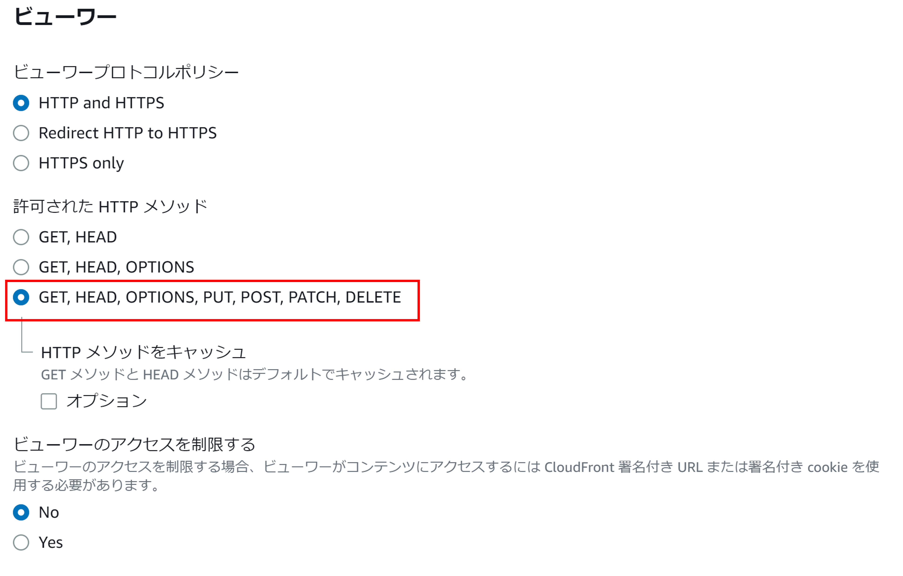

Amazon CloudFrontの設定について補足
========================================

XC Bot Defense for Amazon CloudFrontを利用するにあたり、Amazon CloudFront Distributionのビヘイビアの設定につきまして補足します。

XC Bot Defense for Amazon CloudFrontを利用する際は、設定内容を含むJSONファイルとインストーラーをXC Consoleからダウンロードし、それらファイルを用いて、AWS CloudShellからAmazon CloudFront に設定が適用されます。設定が適用されると、XC Bot Defenseのサービスと連携するために必要なビヘイビアが新たに追加されます。この新たに追加されるビヘイビアの :guilabel:`許可されたHTTPメソッド` の設定は、デフォルトのビヘイビアの :guilabel:`許可されたHTTPメソッド` の設定が引き継がれます。保護対象にPOSTメソッドが含まれる場合は、デフォルトの :guilabel:`許可されたHTTPメソッド` の設定を :guilabel:`GET,HEAD,OPTIONS,PUT,POST,PATCH,DELETE` に設定下さい。

