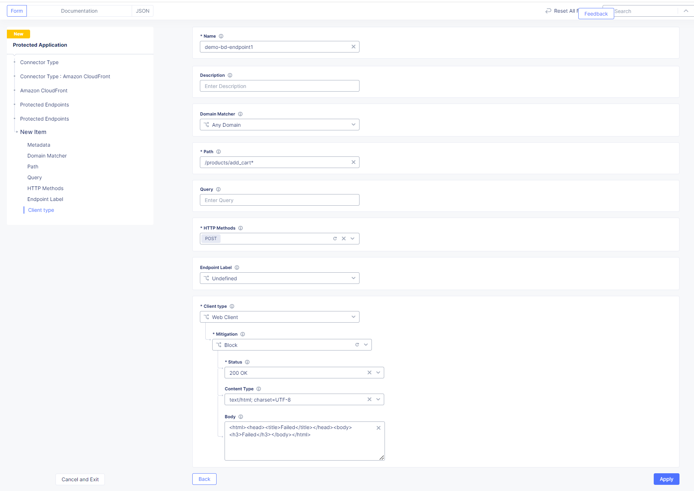

F5 Distributed Cloud Consoleの設定
===============================================

本節では、F5 Distributed Cloud ConsoleでのBot Dedenseの設定を紹介します。

1. F5 Distributed Cloud Consoleのトップページより、 :guilabel:`Bot Defense` をクリックします。

.. image:: images/console_top2.png
   :scale: 15%

2.  :guilabel:`Manage` > :guilabel:`Applications` より、 :guilabel:`+ Add Application` をクリックします。 

.. image:: images/Manage-Application.png
   :scale: 15%

3.  Application設定を入力します。

.. image:: images/Metadata.png
   :scale: 15%

- **Name** : 任意の名前を入力します。
- **Application Region** : US、EU、Asiaから選択します。
- **Connector Type** : Amazon CloudFrontを選択します。
- **Amazon CloudFront** : Configureをクリックし、詳細項目設定します。

4.  詳細項目を設定します。

.. image:: images/Application_detail.png
   :scale: 15%

5.  Amazon Reference Informationを入力します。

.. image:: images/Amazon_reference_Information.png
   :scale: 15%

- **ID** : Amazon CloudFrontのDistribution IDを入力します。

6.  Protected Endpointsの情報を入力します。

- **Name** : 任意の名前を入力します。
- **Domain Matcher** : Any Domain (全てのドメインを対象)、Domain (特定のドメインを指定)を選択します。本ドキュメントではAny Domainを指定します。
- **Path** : 保護対象のパスを選択します。本ドキュメントではカート追加のパス(/products/add_cart*)を入力します。
- **Query** : 必要な場合Query Parameterを入力。本ドキュメントでは空白にします。
- **HTTP Methods** : HTTP MethodをGET(XHR/Fetch)、POST、PUTから選択します。本ドキュメントはカート追加の例になるのでPOSTを選択します。
- **Endpoint Label** : コンソールからモニターする際のラベリングを設定
- **Client Type** : Web Client、Mobile Client、Web And Mobile Clientから選択。本ドキュメントではWeb Clientを選択します。
- **Mitigate** : Continue (リクエストはログだけされてOriginに転送)、Redirect (指定されたページにリダイレクト)、Block (リクエストはブロックし、ブロックページで応答)に設定します。本ドキュメントではBlockで設定します。
- **Status** : ブロックページで応答するときのレスポンスコードを指定します。
- **Content/Type** : Content Typeを選択します。
- **Body** : Blockページをカスタマイズします  

