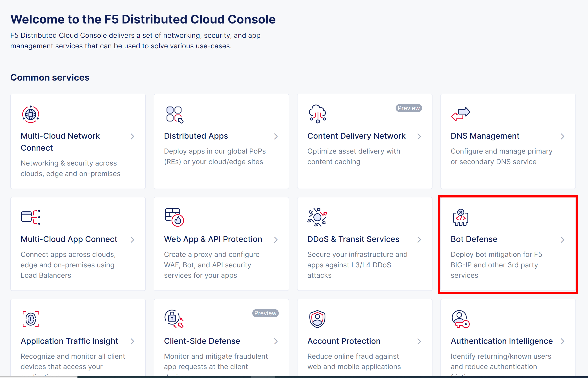
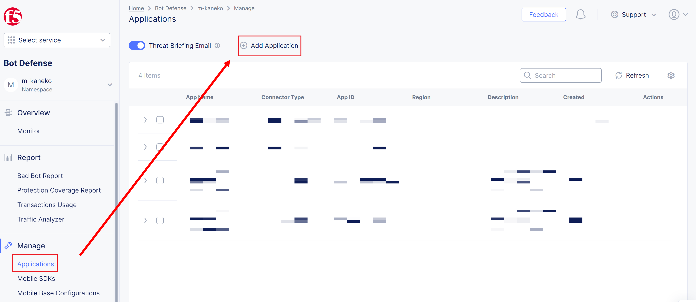
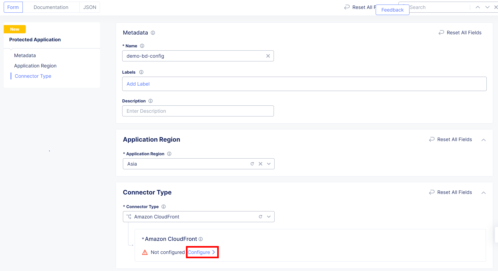
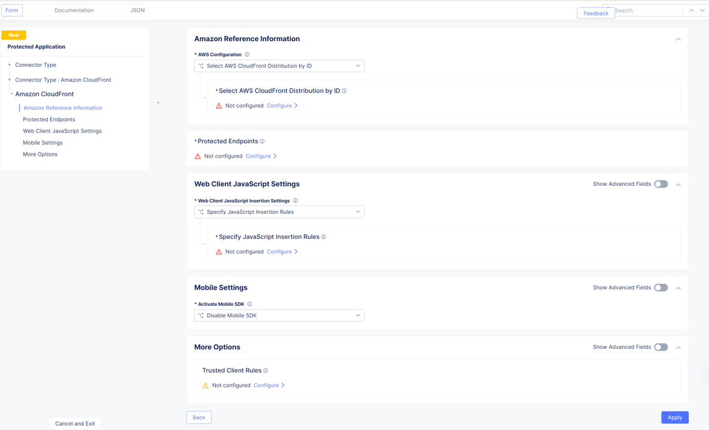
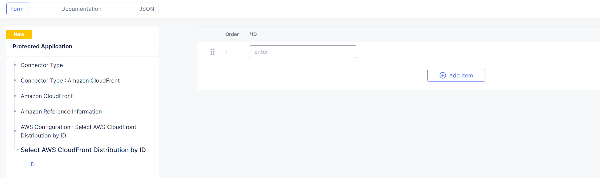
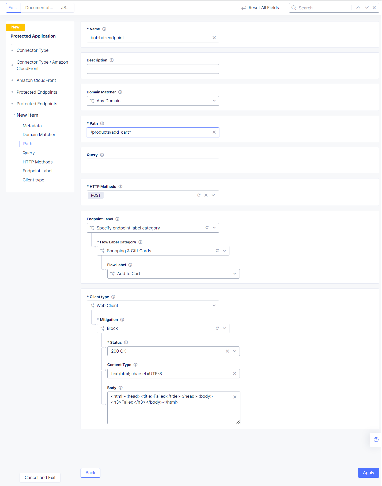
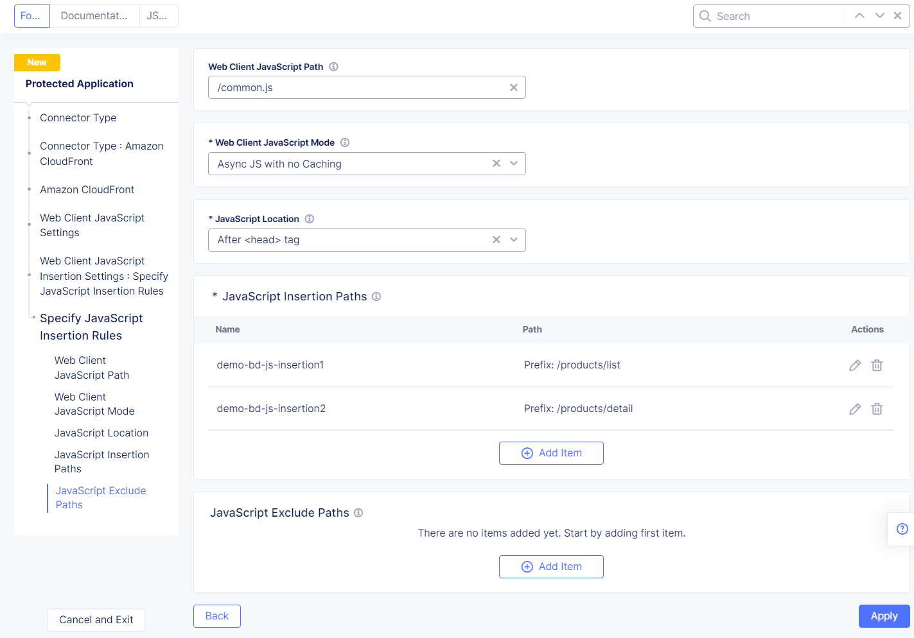
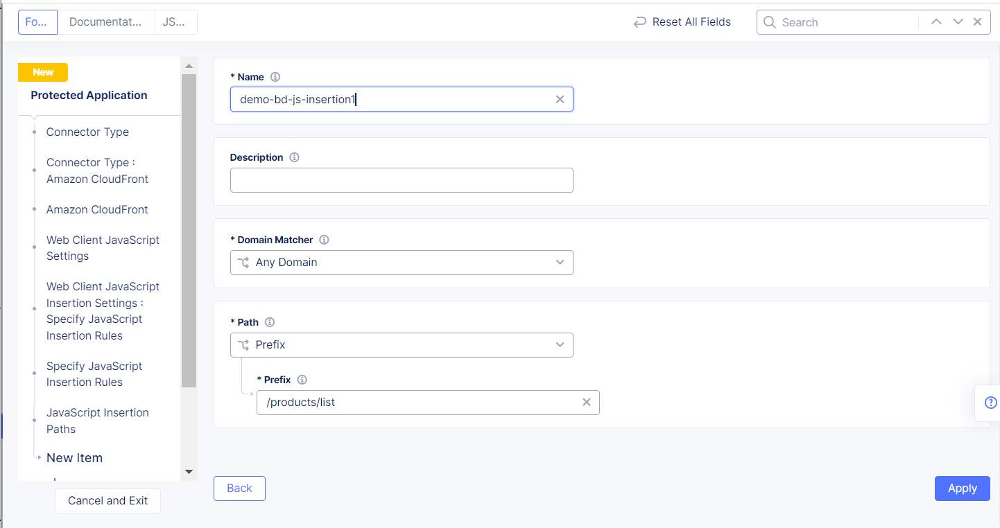
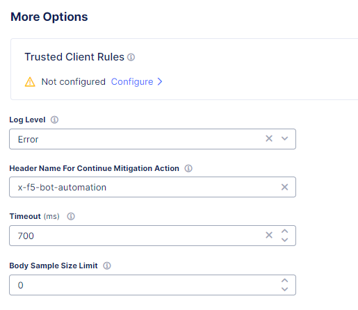
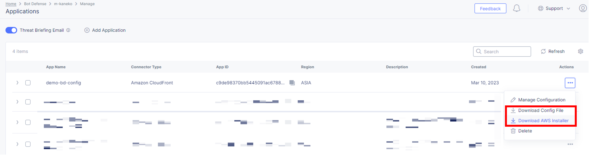

F5 Distributed Cloud Consoleの設定
===============================================

本節では、F5 Distributed Cloud ConsoleでのBot Dedenseの設定を紹介します。

1. F5 Distributed Cloud Consoleのトップページより、 :guilabel:`Bot Defense` をクリックします。

2.  :guilabel:`Manage` > :guilabel:`Applications` より、 :guilabel:`+ Add Application` をクリックします。 

3.  Application設定を入力します。

- **Name** : 任意の名前を入力します。
- **Application Region** : US、EU、Asiaから選択します。
- **Connector Type** : Amazon CloudFrontを選択します。
- **Amazon CloudFront** : Configureをクリックし、詳細項目設定します。

4.  詳細項目を設定します。

5.  Amazon Reference Informationを入力します。

    AWS Configurationは、Apply Distribution Configuration Manually、Select AWS CloudFront Distribution by ID、Select AWS CloudFribt Dustribution by tag matchingから選択できますが、本ドキュメントでは、設定が簡単なSelect CoudFront Distribution by ID を選択し、Configureをクリックします。

- **ID** : Amazon CloudFrontのDistribution IDを入力します。

6.  Protected Endpointsの情報を入力します。

- **Name** : 任意の名前を入力します。
- **Domain Matcher** : Any Domain (全てのドメインを対象)、Domain (特定のドメインを指定)を選択します。本ドキュメントではAny Domainを指定します。
- **Path** : 保護対象のパスを選択します。本ドキュメントではカート追加のパス(/products/add_cart*)を入力します。
- **Query** : 必要な場合Query Parameterを入力。本ドキュメントでは空白にします。
- **HTTP Methods** : HTTP MethodをGET(XHR/Fetch)、POST、PUTから選択します。本ドキュメントはカート追加の例になるのでPOSTを選択します。
- **Endpoint Label** : コンソールからモニターする際のラベリングを設定します。本ドキュメントでは、Flow LabelをShopping & Gift Cards、Flow LabelをAdd to Cartにします。
- **Client Type** : Web Client、Mobile Client、Web And Mobile Clientから選択。本ドキュメントではWeb Clientを選択します。
- **Mitigate** : Continue (リクエストはログだけされてOriginに転送)、Redirect (指定されたページにリダイレクト)、Block (リクエストはブロックし、ブロックページで応答)に設定します。本ドキュメントではBlockで設定します。
- **Status** : ブロックページで応答するときのレスポンスコードを指定します。
- **Content Type** : Content Typeを選択します。
- **Body** : Blockページをカスタマイズします。
必要事項を設定後、右下の :guilabel:`Apply` ボタンを2回クリックします。

7. Web Client JavaScript Settingsの設定

   :guilabel:`Web Client Java Script Settings` で、Specify JavaScript Insertion Rulesを選択し、Specify JavaScript Insertion RulesでConfigureをクリックします。

- **Web Client JavaScript Path** : Bot判定が行われるJavaScriptのPathを指定します。Defaultでは、/common.jsになります。他のWebアプリケーションと同じ名前は避けます。セキュリティのためにF5を連想する名前も避けることをお勧めします。
- **Web Client JavaScript Mode** : Asnyc JS with no Caching、Async JS with Caching、Sync JS with no Caching、Sync JS with Cachingから選択します。※ Async: JavaScriptは読み込まれるとすぐに実行され、ページの読み込みをブロックすることはありません。Sync: JavaScriptが読み込まれ、実行されるまで、ページの読み込みが継続されません。

8. JavaScript Insertion Pathsの設定
   

   JavaScript Insertion Pathsで、 :guilabel:`+ Add Item` をクリックします。

- **Name** : 任意の名前を設定します。
- **Domain Matcher** : Any Domain、またはDomain (ドメイン指定)を選択します。本ドキュメントではAny Domainを選択します。
- **Path** : Prefix(PathのPrefix)、Path(Path名の完全一致)、Glob("*"で複数文字にマッチし、?で一文字にマッチするよう記載可能)を選択します。本ドキュメントでは、Prefixを選択します。
- **Prefix** : Path Prefixを記述します。

必要な事項を設定したら、:guilabel:`Apply` をクリックします。
例では、/prodcts/listの例を示していますが、:guilabel:`+ Add Item` をクリックして/products/detailのエントリも追加します。

必要な事項を設定したら、:guilabel:`Apply` をクリックします。

9. Mobile Settingsの設定

   Activate Mobile SDKで、Mobile SDKを利用する場合は、Enable Mobile SDK、利用しない場合は、Disable Mobile SDKを選択します。本ドキュメントでは、Disable Mobile SDKを選択します。

10. More Optionsにつきまして

- **Trusted Client Rules** : Bot Defenseの処理をスキップさせたいクライアントがある場合はここで設定します。
- **Logs** : Amazon CloudFront ConnectorのLambdaのログのログレベルを設定します。　　- **Header Name For Continue Mitigation Action** : Mitigation ActionをContitnueに設定し、Add Headerの設定をした場合のHeaderの名前
- **Timeout(ms)** : Bot判定のタイムアウト
- **Body Sample Size Limit** :　解析のために送信するリクエストボディのサイズの制限
   
　

必要な事項を設定したら、:guilabel:`Apply` をクリックします。
最後に、:guilabel:`Save and Exit` をクリックします。

11. 設定を適用するためのconfigのjsonファイルとインストーラーのダウンロード

次の章で説明するAmazon CloudFrontに設定を適用するためのConfigのjsonファイルとインストーラーをダウンロードします。

| Configファイル名: <App Name>.json
| Installerファイル名: f5tool

