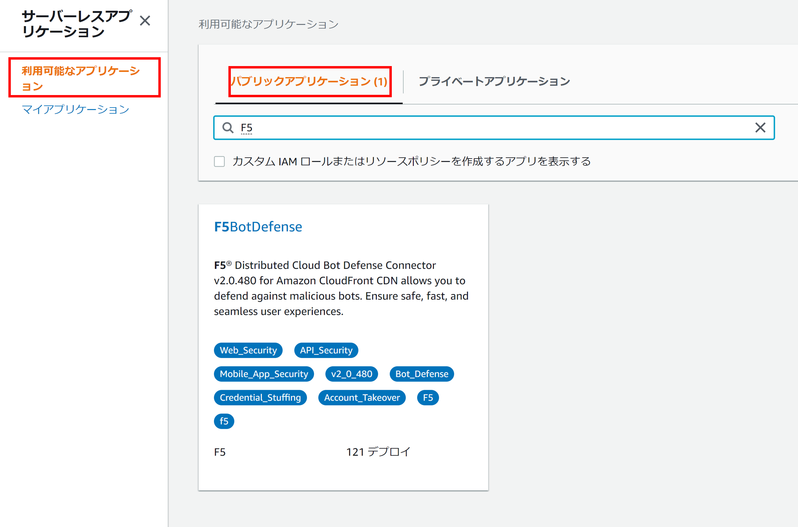
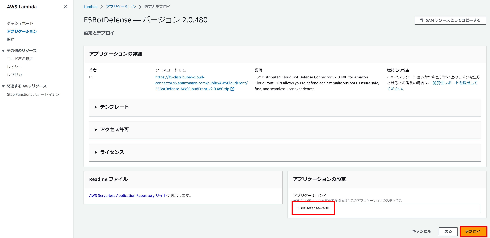
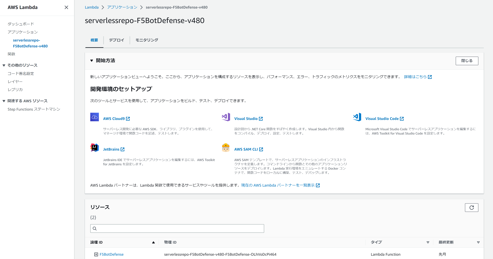

Serverless Application RepositoryからBot Defense Connectorをデプロイ
===========================

本節では、AWSマネージメントコンソールからXC Bot DefenseのAmazon CloudFront Connectorをデプロイする方法を紹介します。

1. AWSマネージメントコンソールより、:guilabel:`Serverless Application Repository` を選択します。

2.  :guilabel:`利用可能なアプリケーション` > :guilabel:`パブリックアプリケーション` を選択し、:guilabel:`F5Bot Defense` を選択 します。

3.  :guilabel:`AWS Lambda` コンソールの画面に遷移するので、:guilabel:`アプリケーションの設定` > :guilabel:`アプリケーション名` で任意の名前を入力、:guilabel:`デプロイ` をクリックします。

4.  XC Bot Defense のアプリケーションのデプロイが完了したことを確認します。

