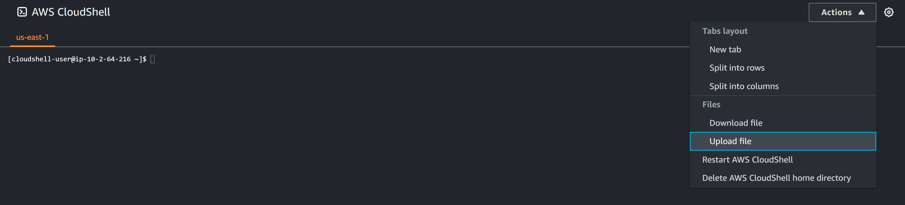
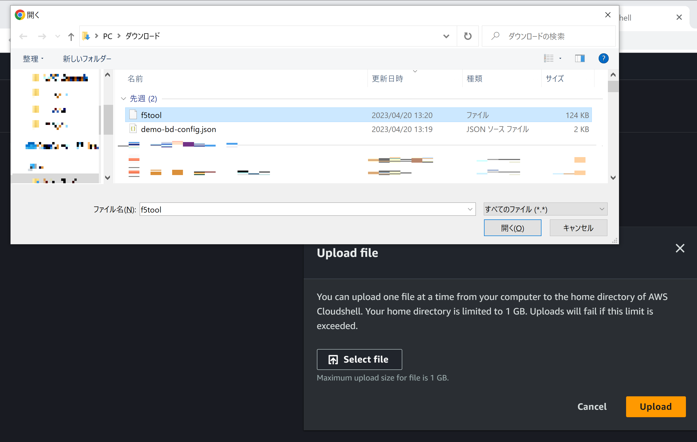
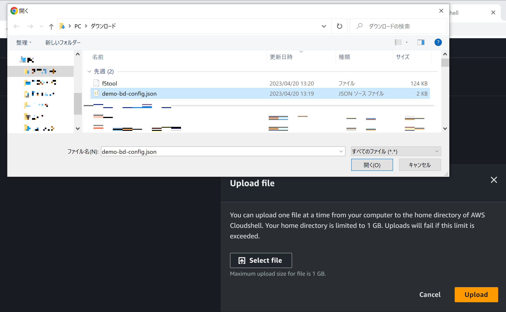

AWS CloudShellよりAmazon CloudFrontへ設定を適用
===============================================

本節では、AWS CloudShellより、前章で説明したインストーラー(f5tool)と設定内容が記載されたJSONファイルをAmazon CloudFrontに適用する方法を説明します。

1. AWSマネージメントコンソールより、AWS CloudShellを立ち上げます。
  .. figure:: images/CloudShell_1.png
     :scale: 20%

2. インストーラー(f5tool)とJSONファイルのアップロード

   F5 Distributed Cloud Consoleよりダウンロードした、インストーラー(f5tool)と設定内容が記載されたJSONファイルをアップロードします。

3. インストーラーの実行

   | AWS CloudShellにてインストーラーを実行します。
 　| 以下のコマンドにてCloudFronに設定が適用されます。

   ::
        bash f5tool --lambda LATEST --install <設定内容が記載されたjsonファイル>

.. fignre:: images/CloudShell_5.png 

