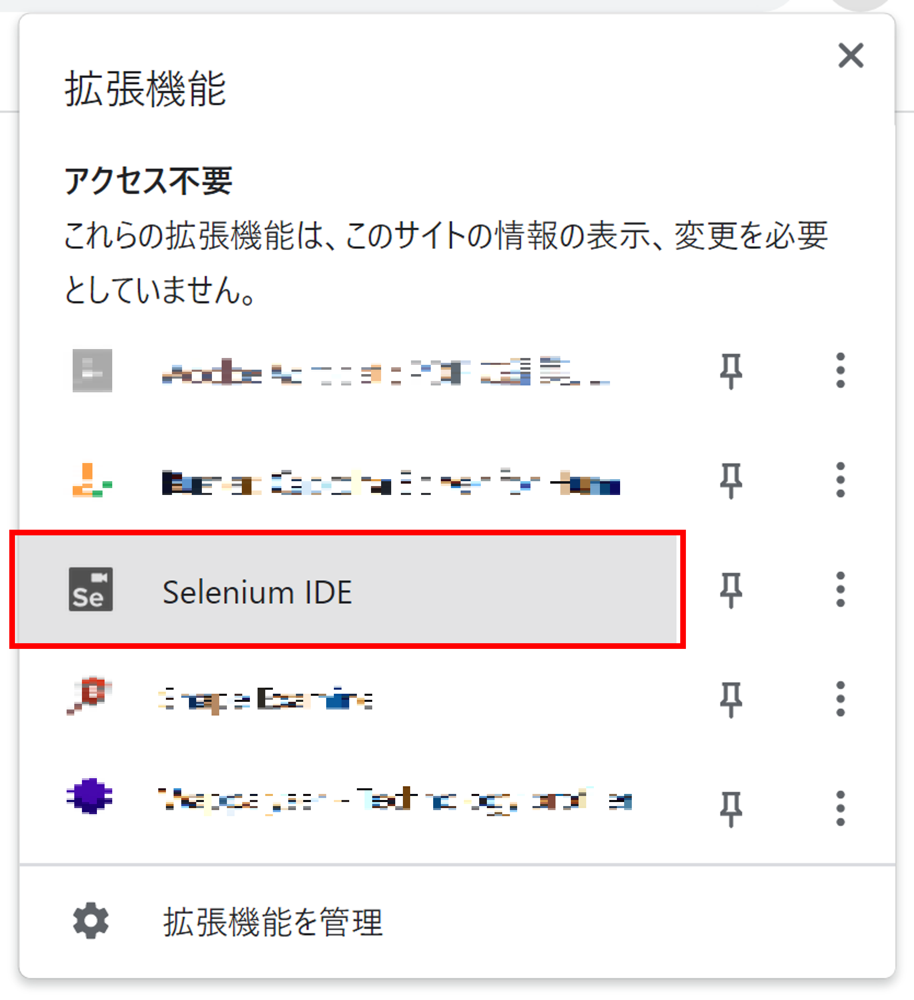
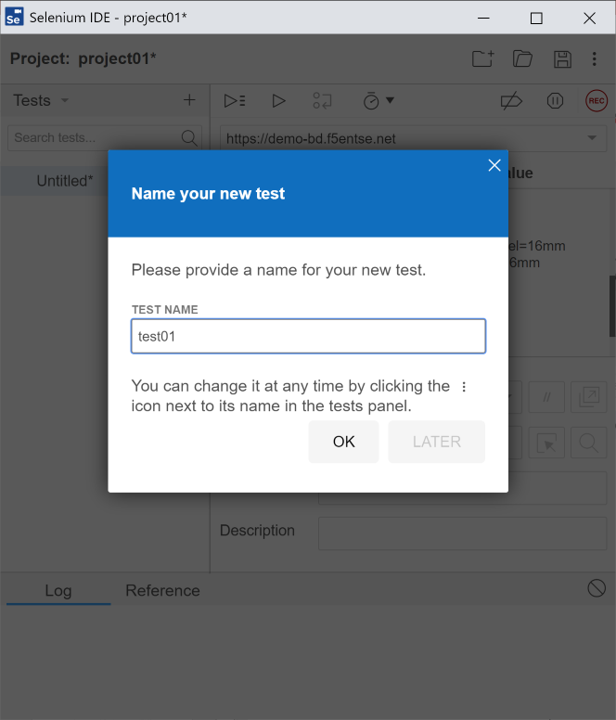
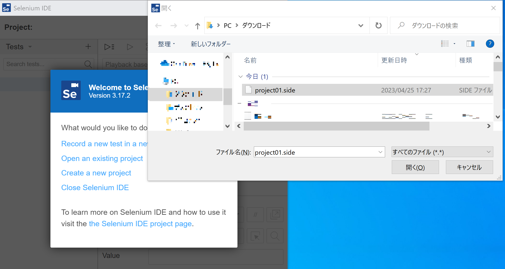

Selenium IDEによるテスト
===========================

以下のURLからSelenium IDEをダウンロードします。

 https://www.selenium.dev/selenium-ide/

本ドキュメントでは、Chromeでの例を示します。

1. Selenium IDEをChromeの拡張機能として追加します。

2. Chromeの拡張機能から、Selenium IDEを起動します。

3.  :guilabel:`Create new project` より、Webアプリケーションの操作を記録します。

4.  任意のProject名を入力します。

5.  :guilabel:`REC` ボタンをクリックした後、操作を記録するWebアプリケーションのURLを入力し、:guilabel:`START RECORDING` をクリックし、カート追加の操作を記録します。

6. 操作の記録が完了したら、RECORDINGを停止します。

7. テスト名を入力し、OKをクリックし、その後、フロッピーディスクのアイコン(Save Project)からこのプロジェクトをSaveします。

8. Selenium IDEを一旦クローズし、再度開きます。:guilabel:`Open an existing project` より先ほどSaveしたProjectをオープンし、記録したカート追加の動作を自動再生します。

