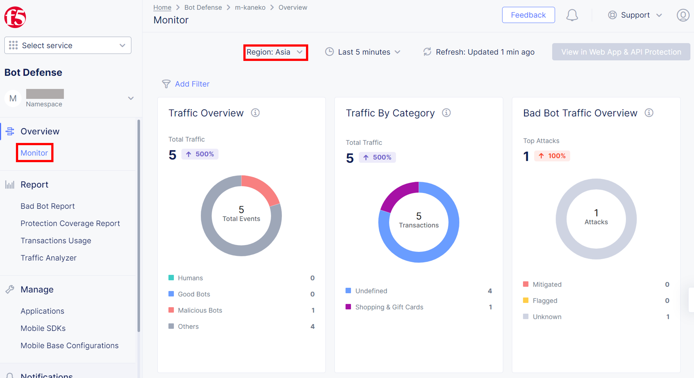
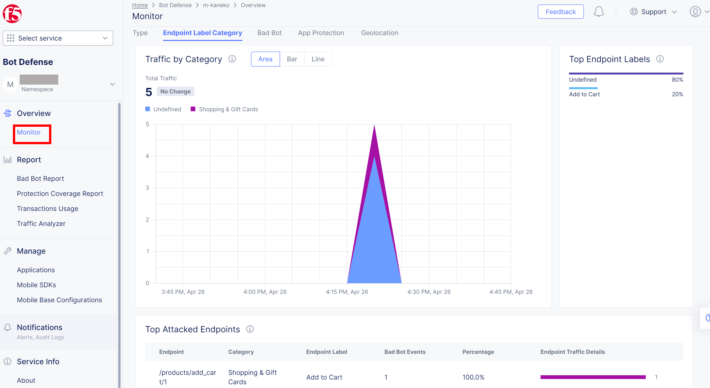
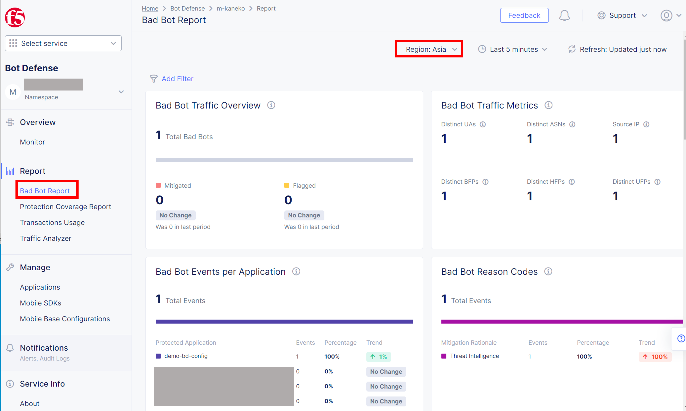
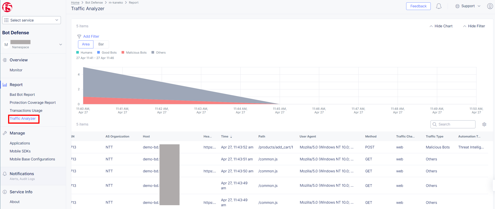

XC Consoleでの確認
===============================================

本節ではXC ConsoleでのBot Trafficの確認方法を説明します。

1. XC Consoleのトップページより、:guilabel:`Bot Defense` をクリックします。

  
  .. figure:: images/console_top2.png
     :scale: 15%

2.  :guilabel:`Overview` > :guilabel:`Monitor` より、Bot Trafficの概要を確認します。本ドキュメントでは、カテゴリー設定で、 :guilabel:`Shopping & Gift Cards` で設定したので、Traffic By Category欄で、:guilabel:`Shopping & Gift Cards` で検出したことが確認できます。

※Regionを設定したところに選択します。

3. 画面をスクロールします。:guilabel:`Top Endpoint Labels` や :guilabel:`Top Attacked Endpoints` の欄で、先に設定した、CategoryやEndpoint LabelでBot Trafficと検出したことがわかります。

4. :guilabel:`Bad Bot Report` より、Botの詳細を確認します。ここで、Botとして検出された理由として、Threat Intelligence (Bot Defenseで作成されたルール)であることが確認できます。

5.  :guilabel:`Traffic Analyzer` より、検出したトラフィックの詳細(IP Address, ASN, Host Header, Path, User Agent, Method, Time, Automation Type等)を確認します。ここでAutomation Type がThreat Intelligenceとなっており、Bot Defenseのルールにより検出できたことが確認できます。

 

